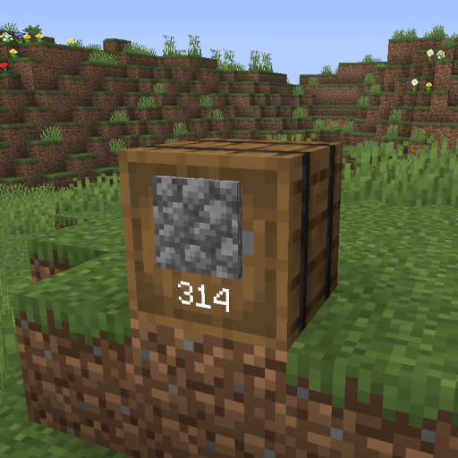

# Drawers

A plugin that adds drawers to your Minecraft server for storing large
quantities of a single item.



## Building

To build the plugin, run

```sh
mvn package
```

## Usage

1. Install plugin jar into your `plugins/` folder
2. Restart your server

## TODO

- [ ] Upgrade GUI
    - [ ] Upgrades (i.e., iron, diamond, etc)
    - [ ] Void Upgrade (cactus)
- [ ] Double right click to add all in current player inventory
- [x] Infinite drawers
- [ ] Commands
    - [ ] Cleanup command to delete all drawers when an admin wants to
      remove the plugin
    - [ ] Make drawer infinite
    - [ ] Delete drawer entities
